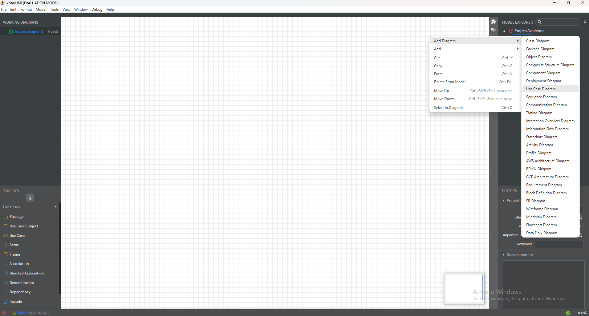
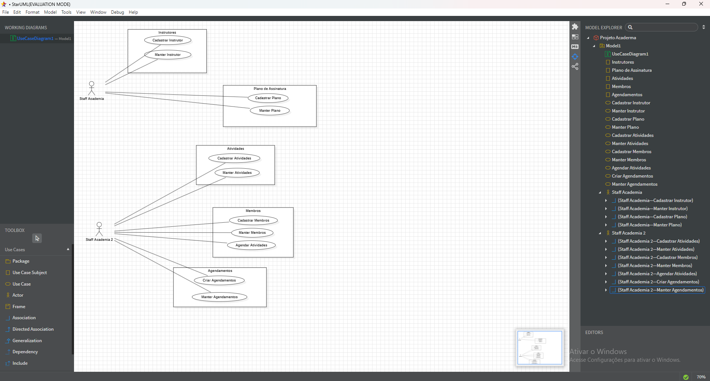
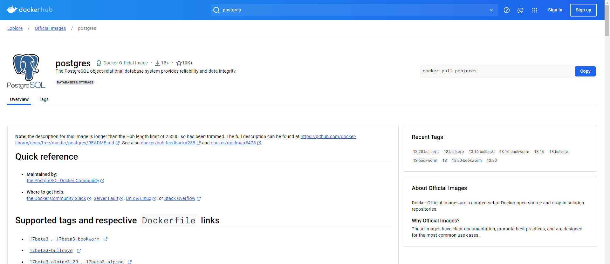
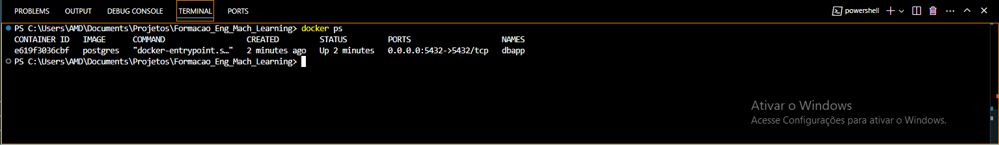

# Formacao_Eng_Mach_Learning

## Projeto Academia

### Ferramenta de UML utilizada:
link para uso de ferramenta: https://staruml.io/

Staff Academia - Time da Academia
O time terá que fazer o cadastro de pessoas na academia, pensando nisso, farei dois casos de uso, um subject

O SGB que será utilizado para essa aplicação será o PostgresSQL
link para uso da ferramenta: https://www.postgresql.org/

Para facilitar a utilização da ferramenta, instanciaremos um docker
https://hub.docker.com/_/postgres

docker pull postgres
docker run --name dbapp -e POSTGRES_PASSWORD=dsacademy -d -p 5432:5432  postgres
name : dbapp
password : dsacademy
porta de acesso : 5432:5432
e619f3036cbfa42ddde79f516a8e09f4ec338df55f4cdbc1ddf21c6c79826b45

PS C:\Users\AMD\Documents\Projetos\Formacao_Eng_Mach_Learning> docker ps

CONTAINER ID   IMAGE      COMMAND                  CREATED              STATUS              PORTS                    NAMES
e619f3036cbf   postgres   "docker-entrypoint.s…"   About a minute ago   Up About a minute   0.0.0.0:5432->5432/tcp   dbapp

Em complemento ao Docker será instalado o PGAdmin https://www.postgresql.org/ftp/pgadmin/pgadmin4/v7.8/windows/

